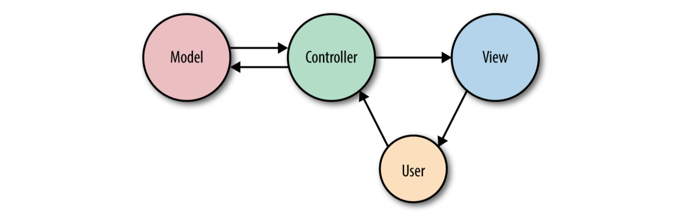

## 简介

任何Web应用框架必要的功能就是获取用户的请求并返回一个响应， 一般是通过HTTP(S)。也就意味着当学习一个Web框架的时候，定义一个应用的路由是第一位的，同时也是要去解决的最重要的部分， 没有路由，你是没法和终端用户交互的。

在本文，我们回去学习Laravel的路由，看看如何定义它们，如何把它们指到要执行代码的地方，怎么样使用Laravel的路由工具来处理不同的路由。

## 路由定义

在Laravel应用里，`Web`相关的路由定义在`routes/web.php`里，`API`相关的路由定义在`routes/api.php`里。Web路由会被终端用户访问到，而`API`路由主要是应用与API，比如你有一个移动客户端。接下来的内容，我们主要关注在web路由 `routes/web.php`。

> 如果Laravel版本早于5.3， 只有一个路由文件 `app/Http/routes.php`

定义一个路由最简单的方式就是匹配一个带有闭包的根路径(比如： `/`)，比如

基本路由定义
```
// routes/web.php
Route::get('/', function() {
    return 'Hello, World!';
})
```

> 什么是闭包？
> 闭包是PHP的匿名函数版本。更详细的说闭包是一个可以作为对象传递，分配给变量，作为参数传递给其他函数和方法，甚至可以序列化。

现在你已经定义了一个路由，如果有人访问 `/`， Laravel有路会执行定义好的闭包并返回结果。 注意这里是 `return` 内容而不是  `echo` 或 `print`。

> 快速了解中间件
> 你可能想要知道，为什么是 `return` `Hello World!` 代替 `echo`。
> 这里也有不少答案，但是最简单的是Laravel的请求和响应周期有很多包装，包括中间件。当路由闭包或者控制器方法执行完的时候，还没有时间将输出发送到浏览器；返回内容允许它在返回给用户之前继续流过响应堆栈和中间件。

许多简单的网站可以完全定义在web路由文件里。一些简单的`GET`路由也可以和模板组合着用，你可以很容易的启动一个网站，比如

简单网站
```
Route::get('/', function () { 
    return view('welcome');
});

Route::get('about', function () { 
    return view('about');
});

Route::get('products', function () {
    return view('products'); 
});

Route::get('services', function () { 
    return view('services');
});
```

> 关于静态调用
> 如果你用PHP开发有一些经验， 你看到对于路由类的静态调用可能有一些惊讶。实际上这不是一个静态方法，而是使用了Laravel的`facade`， 后面会有文章专门来介绍。
> 如果你不喜欢facade， 你也可以完成相同的定义，如
> ```
> $router->get('/', function () { 
>    return 'Hello, World!';
> });
> 

### 路由动作

你可能注意到我们已经在路由定义里使用过 `Route::get`。这意思就是我们告诉Laravel当有一个HTTP请求使用`GET`时只能匹配到这条路由。那如果是form的 `POST`, 或者是JavaScript发送了 `PUT` 或者 `DELETE` 请求呢？ 下面有一些在路由定义时可以用的其他选项。

路由动作
```
Route::get('/', function(){
    return 'Hello, World!';
});

Route::post('/', function(){});

Route::put('/', function(){});

Route::delete('/', function () {}); 

Route::any('/', function () {}); 

Route::match(['get', 'post'], '/', function () {});
```

### 路由处理

正如你可能已经猜到的那样，将闭包传递给路由定义并不是教导它如何解决路由的唯一方法。闭包是快速且简单，但是应用程序越大，将所有路由逻辑放在一个文件中变得越笨拙。另外，使用路由闭包的应用也不能使用Laravel路由缓存，还可以为每个请求减少几百毫秒。

另一个常用的选项是传递一个控制器和方法名作为一个字符串代替闭包，例如

```
Route::get('/', 'WelcomeController@index');
```

该命令是告诉Laravel把请求传给 `App\Http\Controllers\WelcomeController` 控制器的 `index()` 方法。而且也可以传递与闭包相同的参数。

### 路由参数

如果你定义的路由有参数，在路由中定义它们并把它们传递给闭包也是非常简单的。

*路由参数*
```
Route::get('users/{id}/friends', function($id) {
    // your code
});
```


> 关于 **路由参数和闭包/控制器里方法参数之间的命名关系**
> 
> 这里要多说一下，可能很多人对这里都会有些疑问。
> 
> 如你看到上面这个路由参数的例子，它是非常常见的，用于路由参数(`{id}`)和注入到路由定义里(`function($id)`)的方法参数使用相同的参数名。但是这有必要这么做么？
> 
> 除非你使用路由/模型绑定, 否则是没有必要的。定义的路由参数匹配哪一个方法参数唯一要注意的是他们的顺序(从左到右)，看下面的例子
> 
> ```
> Route::get('users/{userId}/comments/{commentId}', function ( 
>     $thisIsActuallyTheUserId,
>     $thisisReallyTheCommentId
> ){
>     //
> });
> ```
> 
> 我推荐它们保持一致，通过命名相同可以减少错误。 // todo
 
通过在参数名后面使用`?`也可以让路由参数变为可选。看下面的代码，这个case中，给参数提供了一个默认值。

*可选的路由参数*
```
Route::get('users/{id?}', function ($id = 'fallbackId') { 
    //
});
```

你也可以使用正则表达式来定义一个路由，该路由只有参数满足实际的要求才会匹配，如

*正则表达式路由*
```
Route::get('users/{id}', function ($id) { 
    //
})->where('id', '[0-9]+');

Route::get('users/{username}', function ($username) { 
    //
})->where('username', '[A-Za-z]+'); 

Route::get('posts/{id}/{slug}', function ($id, $slug) {
    //
})->where(['id' => '[0-9]+', 'slug' => '[A-Za-z]+']);
```

如果你访问的路径匹配到了一个路由，但是正则表达式不匹配参数，那最终也不会匹配到。由于路由匹配是从上到下的，所以 `/users/abc`会跳过第一个路由，但是会匹配到第二条闭包路由。另一方面 `posts/abc/123` 不会匹配到任何一条路由，所以会返回 `404 Not Found`的错误。

### 路由名称

在应用中使用这些路由最简单的方式就是只使用他们的路径(`path`)。`url()` helper 可以简化视图里的链接。看下面的例子，helper 会给路由前面加上网站的完整域名。

*URL helper*
```
<a href="<?php echo url('/'); ?>">
// outputs <a href="http://myapp.com/">
```

而且Laravel还允许你给每个路由起一个名字，使你可以在不明确引用URL的情况下使用它。这很有帮助，因为这意味着你可以给复杂的路由提供简单的昵称，并且因为按名称链接它们意味着如果路径更改，则不必重写前端链接。

*定义路由名称*
```
// Defining a route with name in routes/web.php:
Route::get('members/{id}', 'MembersController@show')->name('members.show'); 

// Link the route in a view using the route() helper
<a href="<?php echo route('members.show', ['id' => 14]); ?>">
```

这个例子也提到了几个新的概念。首先是可以通过在 `get()` 方法之后通过链式方法 `name()` 使用熟练的路由定义来添加名称。然后这个方法允许我们指定一个简短的别名，来在其他地方更容易的使用。

我们命名路由为 `members.show`， 资源复数 在Laravel的路由和视图名也是常用的规范。

> *关于路由命名规范*
>
> 你可以命名路由按照你喜欢的方式，但是常用到的规范是使用资源名称复数，然后使用一个点 `.`, 然后是具体的动作。这里有一组给图片资源命名的最常用到的路由名称：
> 
> ```
>     photos.index
>     photos.create
>     photos.store
>     photos.show
>     photos.edit
>     photos.update
>     photos.destroy
> ```

我们也介绍过 `route()` helper, 就像 `url()` 一样，它的目的是在视图中使用，以简化与命名路由的链接。如果路由里没有参数，你可以简单的传一个路由名 `route('members.index')` ，然后会收到一个路由字符串 `http://myapp.com/members/index`。如果有参数，以数组的形式传入第二个参数里。

一般情况下，我推荐使用路由昵称来代替使用路由路径，因此使用 `route()` 代替 `url()`。


> *关于传递路由参数到route()*
> 
> 当路由有参数的时候(比如: `users/{id}`), 在使用 `route()` 生成链接给路由的时需要定义这些参数。
> 
> 传递参数有几种不同的方式，设想一个路由是 `users/{userId}/comments/{commentId}`。 如果用户ID是1，评论ID是2，来看下我们可以使用的几种方式：
> 
> 方式1：
> ```
> route('users.comments.show', [1, 2]) 
> // http://myapp.com/users/1/comments/2
> ```
> 
> 方式2：
> ```
> route('users.comments.show', ['userId' => 1, 'commentId' => 2]) 
> // http://myapp.com/users/1/comments/2
> ```
> 
> 方式3：
> ```
> route('users.comments.show', ['commentId' => 2, 'userId' => 1]) 
> // http://myapp.com/users/1/comments/2
> ```
> 
> 方式4：
> ```
> route('users.comments.show', ['userId' => 1, 'commentId' => 2, 'opt' => 'a']) 
> // http://myapp.com/users/1/comments/2?opt=a
> ```
> 
> 如你所见，没有key的数组是需要按顺序指定的，带有key的数组通过和路由里的key进行匹配，剩下的会被作为查询参数。

## 路由组

通常，一组路由共享一个特定的特征 - 特定的身份验证要求，路径前缀或控制器命名空间。在每一条路由里一遍又一遍的定义这些共享的特征不仅看起来乏味，而且可能会玷污你的路由文件，并且掩盖应用程序的某些结构。

路由组允许将几个路由组合到一起，应用共享的配置到整个路由组一次，减少重复。另外，路由组也是给未来开发者的一个可以看的见的线索。

要讲两个或更多个路由组合到一起，你要围绕一组路由。如下

*定义一组路由*
```
Route::group([], function(){
    Route::get('hello', function() {
        return 'Hello';
    });

    Route::get('world', function() {
        return 'world';
    })
});
```

默认情况下，路由组实际上不会做任何事情。上面的代码和之前的路由基本没啥区别。其中第一个参数是一个空数组，允许传入多重配置参数去应用到整个路由组。

### 中间件

可能对路由组最常用的就是应用一个中间件到一组路由组。后面会专门写一片关于中间件的文章。除此之外，它们是Laravel用于验证用户身份并限制访客使用网站的某些部分的内容。

下面的例子，是我们创建了一个路由组，包含 `dashboard` 和 `account` 视图，应用 `auth` 中间件到这两个路由。在这个例子中也就意味着用户必须登录到应用里来看 `dashboard` 和 `account` 页。

*只有登录用户可以访问的路由组*
```
Route::group(['middleware' => 'auth'], function(){
    Route::get('dashboard', function(){
        return view('dashboard');
    });

    Route::get('account', function(){
        return view('account');
    })
});
```

**关于在控制器中使用中间件**

经常在控制器中使用路由中间件比在路由定义里可能更清晰，更直接。你可以在控制器的构造方法里使用 `middleware()` 方法来做到。给 `middleware()` 传递的参数就是中间件的名称。你也可以链式调用一些方法(比如: `only()`, `except()`) 来定义哪些方法将接受该中间件。

```

class DashboardController extends Controller {
    public function __construct() 
    {
       $this->middleware('auth');

       $this->middleware('admin-auth')
            ->only('admin');
        
        $this->middleware('team-member')
           ->except('admin');
} }
```

请注意，如果你大量的使用 `only` 和 `except`, 以后会很难维护，所以不建议大面积这么使用。

### 路径前缀

如果你有一组路由要共享一个path， 比如你网站的API是以 `/api`开头的，那就可以使用路由组来指定这个结构，如

*前缀路由组*
```
Route::group(['prefix' =>'api'], function(){
    Route::get('/', function(){
        // handle the path /api
    });

    Route::get('users', function(){
        // handle the path /api/users
    });
});
```

> 注意每一个前缀路由组都会有一个 `/` 路由来表示根前缀，在这里就是 `/api`

### 子域名路由

子域名路由和路由前缀一样，但是它的作用域是子域名而不是路由前缀。有两种主要的使用方法。

第一种，你可以让整个应用分为不同的几个部分(或不同的应用)到不同的子域名，来看下怎么实现

*子域名路由*
```
Route::group(['domain' => 'api.myapp.com'], function(){
    Route::get('/', function(){
        //
    });
});
```

第二种，你也可以将子域名的一部分作为参数，最常见的例子就是slack，比如每一个公司都有自己的子域名 `phpcasts.slack.co`。

*参数化的子域名*
```
Route::get(['domain' => '{account}.myapp.com'], function(){
    Route::get('/', function($account) {
        //
    });

    Route::get('users/{id}', function($account, $Id){
        //
    });
});
```

> 注意，路由组里的任何一个参数都可以传入到组里的路由方法里作为第一个参数，如果是多个就依次写。

### 命名空间前缀

当你按子域名或路由前缀对路由进行分组时，很可能他们的控制器有一个类似PHP命名空间。在API的例子里，所有的API路由控制器可能都在 `API` 命名空间。 通过使用路由组命名空间前缀，可以避免在诸如 `API/ControllerA@index` 和 `API/ControllerB@index` 之类的组中使用较长的控制器引用。

*路由组命名空间前缀*
```
// App\Http\Controllers\ControllerA
Route::get('/', 'ControllerA@index'); 

Route::group(['namespace' => 'API'], function () {
    // App\Http\Controllers\API\ControllerB
    Route::get('api/', 'ControllerB@index');
});
```

### 名称前缀

前缀并不止于此。通常路由名称会反映路径元素的继承链，因此 `users/comments/5` 将由名为 `users.comments.show` 的路由提供服务。 在这种情况下， 通常在 `users.comments` 资源下的所有路由上层使用路由组。

*路由名称前缀*
```
Route::group(['as' => 'users.', 'prefix' => 'users'], function () { 
    Route::group(['as' => 'comments.', 'prefix' => 'comments'], function () {
        // Route name will be users.comments.show
        Route::get('{id}', function () { 
            //
        })->name('show');
    });
});

```

## 视图

> 这部分先简单了解下就可以了，后面会有专门一文来说模板视图。

目前为止我们看到的路由闭包里，使用过一行 `view('account')`。这里是发生了什么呢？

如果你不熟悉 Model-View-Controlelr(MVC)模式， `views` (或者是模板) 是描述一些实际输出的文件。你也可能用于 `JSON` 或者 `XML` 或者 邮件 的视图，但是在Web框架里最常用的视图是输出 HTML。

在Laravel, 有两种可以立即使用的视图格式：`plain php` 和 `Blade` 模板。不同的是在于文件名：`about.php` 会被PHP引擎来渲染， `about.blade.php` 则会被 `Blade` 引擎渲染。

> *关于加载模板视图的三种方式*
>
> 有三种不同的方式来返回视图。到目前，只是控制器自己使用过 `view()`， 但你曾可能看到过 `View::make()` 的话，它和 `view()` 做的事是一样的，还可以使用*注入*的方式 `Illuminate\View\ViewFactory`。

*view()的简单使用*
```
Route::get('/', function () { 
    return view('home');
});
```

这段代码将会寻找 `resources/views/home.blade.php` 或 `resources/views/home.php` 视图文件，并加载里面的内容，解析PHP代码 或 控制结构语句知道视图输出。一旦返回之后，被专递到响应栈的剩余部分，最终返回给用户。

但是如果你需要传递变量呢？ 来看下面的例子

*传递变量到模板*
```
Route::get('tasks', function(){
    return view('tasks.index')
        ->with('tasks', Task::all());
});
```

### 使用 `View Composers` 与每一个视图共享变量

有时候一遍又一遍的传递同样的变量到模板会感觉很麻烦。这个变量可能是网站的每个视图都要访问的，或者是某一类视图，再或者是一些子视图，比如 所有的视图都会用到的 header 。 

*视图共享变量*
```
view()->share('variableName', 'variableValue');
```

## 控制器

我已经好几次提到过控制器，但直到现在大多数的例子中只展示了路由闭包。如果不熟悉 MVC 模式(看下图)，控制器本质上是一个类，它将一条或多条路由的逻辑组织在一起。控制器倾向与将类似的路由组合在一起，特别是如果你的应用是按照传统的类似CRUD的格式构建的；在这种情况下，控制器可能会处理可以在特定资源上执行的所有操作。



> *关于什么是CRUD*
>
> CRUD 代表创建、读取、更新、删除，这是Web应用程序最常提供的四项主要操作。例如，你可以创建新的博客文章，可以阅读该文章，可以更新它，也可以将其删除。

将所有应用程序的逻辑嵌入到控制其中可能很诱人，但最好将控制器看做是将HTTP请求路由到应用程序的交通警察。由于还有其他的方式可以将请求加入到你的应用程序中，例如 `cron` 作业，`Artisan` 命令行调用，队列作业等等，所以不要依赖控制器来处理太多行为。这意味着控制器的主要工作是捕获HTTP请求的意图并将其传递给应用程序的其余部分。

来创建一个控制器，最简单的方式就是通过 Artisan 命令，在命令里运行如下命令

```
php srtisan make:controller TasksController
```

> *关于Artisan和Artisan生成器*
> Laravel 自带了一个名为Artisan的命令行工具。Artisan 可用于运行迁移，手动创建用户和其他数据库记录，一次性任务等等。
> 在 make 命令下，Artisan提供了用于为各种系统文件生成骨架文件的工具。
> 后面会专门文章来介绍 Artisan。

这条命令会在 `app/Http/Controllers` 目录下创建一个名为 `TasksController.php` 的新文件，同时包含一下内容

*默认生成的控制器*
```
<?php

namespace App\Http\Controllers;

use Illuminate\Http\Request; 
use App\Http\Requests;

class TasksController extends Controller 
{
}
```

修改这个文件然后增加一个新的方法 `home()`， 返回一些简单的文本

*简单的控制器*
```
<?php

use App\Http\Controllers\Controller;

class TasksController extends Controller 
{
    public function home() 
    {
        return 'Hello, World!'; 
    }
}
```

这个之前有学过，来看下如何把一个路由绑定到这个控制器上。

*路由和控制器绑定*
```
<?php

Route::get('/', 'TasksController@home');
```

这样就可以通过访问 `/` 路由看到返回的内容了 `Hello, World!`。

> *关于控制器的命名空间*
> 在上面的例子中看到，我们引用了一个完全限定类名的控制器 `App\Http\Controllers\TasksController`, 但只使用了类名。
> 这不是因为我们简单地通过它们的类名来引用控制器，相反，当我们引用控制器时，我们忽略了 `App\Http\Controllers\`; 默认情况
> 下，Laravel 配置为在该命名空间下查找控制器。

控制器方法最常用的用法如下

*常用的控制器方法*
```
// TasksController.php
...
public function index() 
{
    return view('tasks.index') 
        ->with('tasks', Task::all());
}
```

这个控制器方法加载了 `resources/views/tasks/index.blade.php` or `resources/views/tasks/index.php` 视图，并传递了一个名为 `tasks` 的变量，其值是一个 `Task::all()` 的查询结果。

> *生成资源控制器*
> 如果你曾在Laravel 5.3之前使用过 `php artisan make:controller`，你可能期望它来自动生成所有基本的资源路由如 `create()` 和 `update()`。在5.3之后需要使用 `--resource` 参数来生成，如 `php artisan make:controller TasksController --resource` 。

### 获取用户输入

在控制器方法里第二个最常用的动作就是获取用户输入的参数并使用它。这里引入了一些新的概念，来看下代码

*基本的动作绑定*
```
// routes/web.php
Route::get('tasks/create', 'TasksController@create');
Route::post('tasks', 'TasksController@store');
```

注意这里我们绑定了 `GET` 动作到 `tasks/create` (显示表单), `POST` 动作绑定到了 `tasks/` (当创建任务的时候POST数据)。我们假设 `create()` 方法只显示表一个form表单，所以来看下 `store()` 方法。

*通用表单输入控制器的方法
```
// TasksController.php
...
public function store() 
{
    $task = new Task;
    $task->title = Input::get('title'); 
    $task->description = Input::get('description'); 
    $task->save();

    return redirect('tasks'); }
```

这个例子中使用了 `Eloquent` model 和 `redirect()` 函数，后面会详细介绍，而且你也可以看到它实际上做了什么。我们创建了一个新 `Task`， 获取用户输入的数据，设置 task model, 保存，最后跳转会任务列表页。

有两种方式可以获取用户输入的数据： `facade` 方式和 `Request` 对象(这个后面新开文章来写)。

> *关于导入facade*
> 运行上面的代码你可能发现会报 `Input` facade找不到，这是因为它们(facade)不会出现在每一个 `namespace` 下。但在根命名空间下是有效的。所以我们需要在文件顶部导入 `Input` facade。有两种方式导入: `\Input` 或 `Illuminate\Support\Facades\Input`。如
> ```
> <?php
> namespace App\Http\Controllers;
> 
> use Illuminate\Support\facades\Input;
> // or \Input
> 
> class TasksController 
> {
>     public function store() 
>     {
>         $task = new Task;
>         $task->title = Input::get('title'); 
>         $task->description = Input::get('description'); 
>         $task->save();
> 
>         return redirect('tasks'); 
>     }
> }
```

### 依赖注入到控制器

Laravel的 `facade` 为Laravel的代码库中最有用的类提供了一个简单的接口。通过使用简单的 `facade` 可以获取关于当前请求，用户输入，session, cache 的信息等。

但如果你更喜欢注入依赖或者使用一个service, 你需要找到一些传入这些类实例到控制的方法。

这也是我们要将的，关于Laravel的服务容器(service container)。到目前，如果不熟悉这点，你可以认为这是Laravel的一点小魔法，关于容器更多的内容后面章节会有讲解。

所有控制器方法(包括构造行数)都从 Laravel 的容器中解析出来， 这意味着你键入的任何内容容器都知道如何解决都会被自动注入。
下面有一个很好的例子，如果你希望有一个 `Request` 对象的实例， 而不是使用 `facade`， 那该怎么办？ 可以仅仅键入 `Illuminate\Http\Request` 在方法参数里，如

*控制器方法注入*
```
// TasksController.php
...
public function store(\Illuminate\Http\Request $request) 
{
    $task = new Task;
    $task->title = $request->input('title'); 
    $task->description = $request->input('description'); 
    $task->save();
    
    return redirect('tasks'); 
}
```

顺便说一句，这实际上是我和其他许多Laravel开发人员更喜欢获取用户输入的方式：注入 `Request` 的实例并从那里读取用户输入，而不是依赖 `Input` facade。

### 资源控制器

有时在控制器里命名一个方法名可能是写一个控制器非常艰难的一部分。 值得庆幸的是，Laravel 对传统 REST/CRUD 控制器(Laravel中称为资源控制器)的所有路由都有一些约定；此外，它附带了一个开箱即用的生成器和一个便捷的路由定义，可让你一次绑定整个资源控制器。

想要看Laravle资源控制器提供的方法，我们可以通过命令行来生成一个

```
php artisan make:controller MySampleResourseController --resource
```

现在打开 `app\Http\Controllers\MySampleResourceController.php` 。你就可以看到增加一些方法。让我们来看下每一个代表什么，通过 `Task` 例子来理解。

#### Laravel资源控制器的方法

通过这个表格来看下

|动作|URL|控制器方法名|路由名|描述|
|:--|:--|:--|:--|:--|
|GET|tasks|index()|tasks.index| 展示所有的task|
|GET|tasks/create|create()|tasks.create|展示创建task的表单form|
|POST|tasks|store()|tasks.store|接收来自创建task表单的提交|
|GET|tasks{/task}|show()|tasks.show|展示一条task|
|GET|tasks/{task}/edit|edit()|tasks.edit|编辑一条task|
|PUT/PATCH|tasks/{task}|update()|tasks.update|接受来自编辑表单的提交|
|DELETE|tasks/{task}|destory()|tasks.destory|删除一条task|

可以看到每一个HTTP动作都有一个 URL, 控制器方法名，路由名称和描述。

#### 绑定一个资源控制器

如我们看到的，这些是在 Laravel中使用的 传统路由名称，并且很容易为每个这些默认路由生成一个资源控制器和方法。幸运的是，你不必手动为每一个控制器方法生成路由。代替的是，这里有一个叫做资源绑定的动动。

*资源控制器绑定*
```
// routes/web.php
Route::resource('tasks', 'TasksController');
```

该命令会自动绑定所有路由到指定控制器上适合的方法名。它也会适当的命名这些路由；例如 `tasks` 资源控制器里的 `index()` 方法将会被命名为 `tasks.index`

## 路由模型绑定

最常用的路由模式之一就是在任何控制器方法的第一行就去通过给定的ID查找资源，比如

*获取资源*
```
Route::get('conferences/{id}', function($id) {
    $conference = Conference::findOrFail($id);
});
```

Laravel提供了一种简化称为“路由模型绑定”的模式的功能。

有两种路由模型绑定：隐式和自定义(或显式)

### 隐式的路由模型绑定

使用路由模型绑定最简单的方式是为该模型指定唯一的路由参数(例如：将其命名为 `$conference` 而不是 `$id`), 然后在闭包/控制器的方法里键入这个参数，并使用同名的变量就可以了。如

*使用隐式的路由模型绑定*
```
Route::get('conferences/{conference}', function (Conference $conference) { 
    return view('conferences.show')->with('conference', $conference);
});
```
由于路由参数(`{conference}`)和方法参数名($conference)一样， 方法参数键入时带有 `Conference` model(Conference $conference)， Laravel看到这个会作为一个路由模型绑定。每次这个路由被访问到的时候，应用都会假设无论传入什么到URL，都会用 ID来替代 `{conference}`，然后通过ID去到对应的 `Conference` model里查找。`Conference`实例都会被转入闭包或者控制器方法里。

> 隐式路由模型绑定是在 Laravel 5.2版本中加入的，所以在 5.1 版本里是没法是没法使用的。


### 自定义路由模型绑定

要手动的配置路由模型绑定，可以添加 像下面的一行到文件 `App\Providers\RouteServiceProvider` 的 `boot()` 方法里。

*添加路由模型绑定*
```
public function boot(Router $router) 
{
    parent::boot($router);
    
    // Perform the binding
    $router->model('event', Conference::class);
}
```

现在你已经定义了每当路由的定义中有一个名为 `{event}` 的参数时，路由解析器将返回具有该URL参数的ID的Conference类实例。

*显式路由模型绑定*
```
Route::get('events/{event}', function (Conference $event) { 
    return view('events.show')->with('event', $event);
});
```

## 路由缓存

## Form方法欺骗

### HTTP 方法介绍

### Laravel 中的HTTP

## 跳转

## 自定义响应

## 单元测试

## 总结


