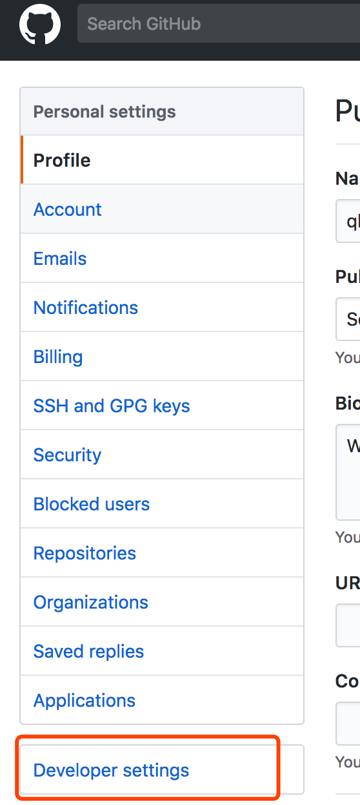
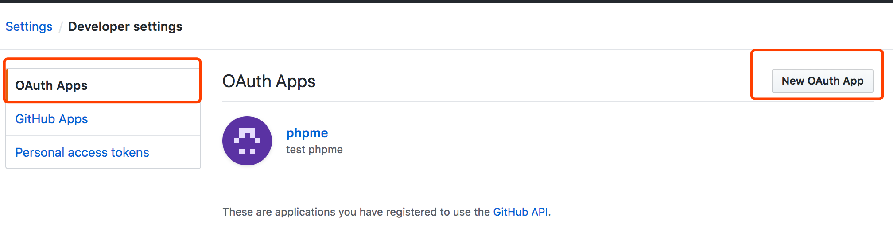
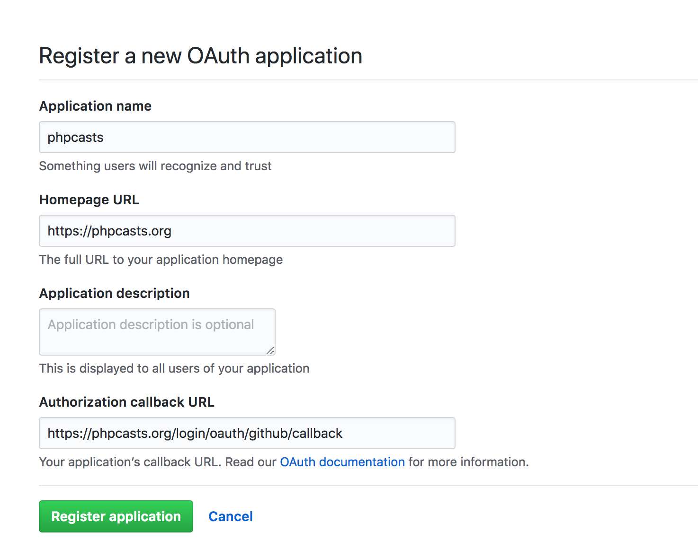
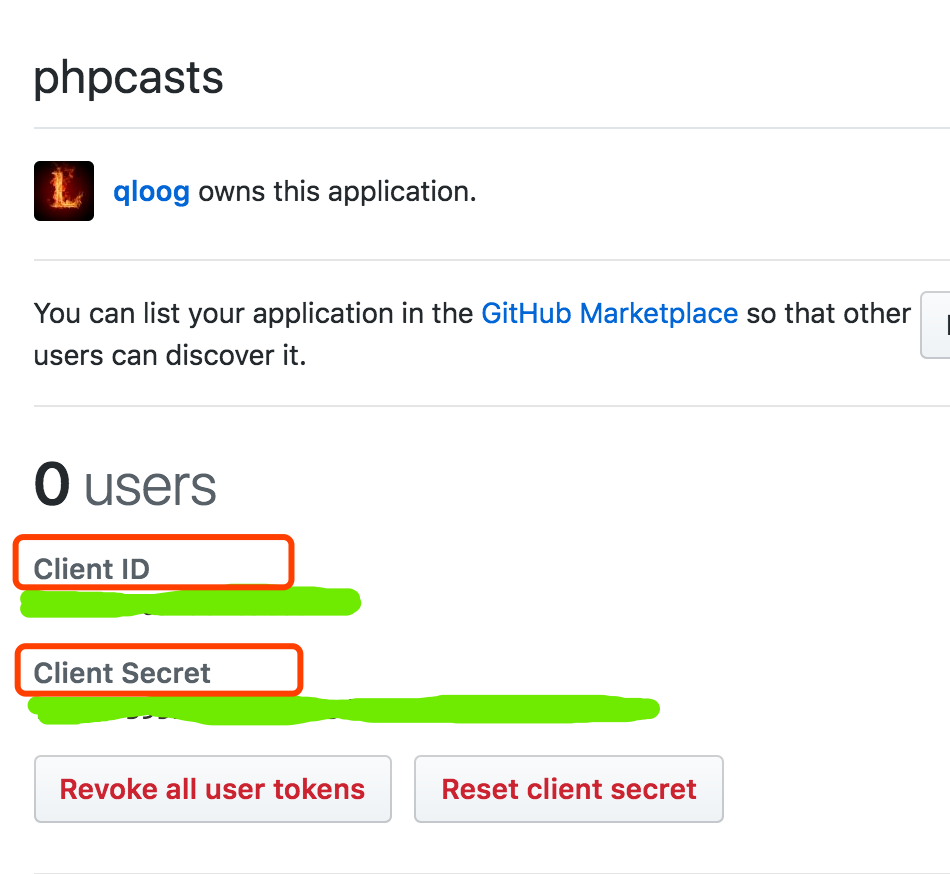
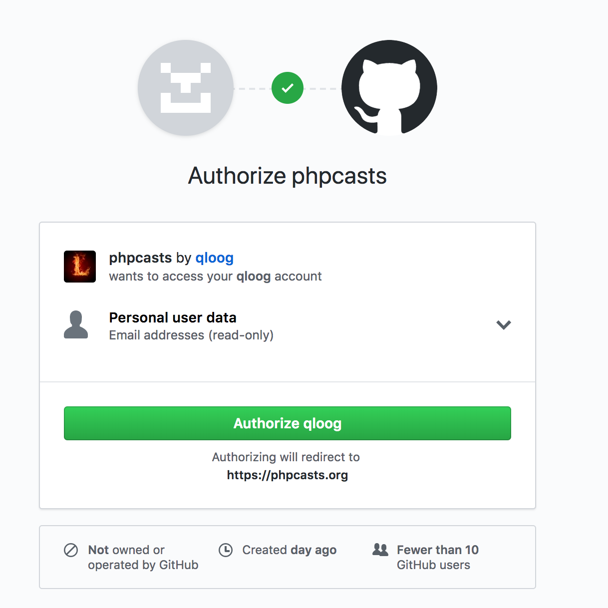

### 大纲

    1. 简介
    2. 授权流程说明
    3. 集成第三方Package
    4. 定义路由
    5. 创建Github应用
    6. 配置Github
    7. 控制器实现
    8. 数据库表修改
    9. 访问范围
    10. 获取用户详细信息
    11. 实际使用
    11. 更多
    12. 扩展微信登录：https://juejin.im/entry/57a4a3986be3ff0065297533


### 简介

使用社交网络帐号登录如今已经是很多网站的标配了，比如使用Github、微信、微博、QQ等，因为它可以简化用户的注册流程，从而很轻松的成为一个目标网站的注册用户。本文也是为本站开发社交网络帐号登录而写的一篇文章，记录下开发的过程。希望也对看到本文的同学也所帮助。 我这里主要使用Github帐号进行登录。

### 授权流程说明

​Github网站应用登录是使用 [OAuth2.0](https://zh.wikipedia.org/wiki/%E5%BC%80%E6%94%BE%E6%8E%88%E6%9D%83) 授权登录系统让用户可以安全登录，在用户授权登录已接入Github OAuth2.0的第三方应用后，第三方可以获取到用户的接口调用凭证（access_token），通过access_token可以进行Github开放平台授权关系接口调用，从而可实现获取Github的用户基本开放信息。

整体流程为：

 - 1. 第三方发起Github授权登录请求，Github用户允许授权第三方应用后，Github会拉起应用或重定向到第三方网站，并且带上授权临时票据code参数；
 - 2. 通过code参数加上ClientID和ClientSecret等，通过API换取access_token；
 - 3. 通过access_token进行接口调用，获取用户基本数据资源。

### 集成第三方Package

本站主要使用Laravel官方提供的Package: `Laravel/socialite` 来进行接入。

#### 1、安装

通过强大的Composer来进行安装

```
composer require laravel/socialite -vvv
```

#### 2、配置

我们知道Laravel集成第三方包到框架主要是通过provider来进行注册，这里也一样：

```
// config/app.php
    'providers' => [
        ...
        Laravel\Socialite\SocialiteServiceProvider::class,
        ...
    ],
    
    'aliases' => [
        ...
        'Socialite' => Laravel\Socialite\Facades\Socialite::class,
        ...
    ],
```

### 注册路由

在Web路由文件中 `routes/web.php` 需要定义两个路由：

```
Route::get('login/oauth/{driver}', 'Auth\LoginController@redirectToProvider');
Route::get('login/oauth/{driver}/callback', 'Auth\LoginController@handleProviderCallback');
```

这里我们使用了 `{dirver}` 参数，也就是除了github， 我们接入其他授权系统也可以使用这两个路由。

### 创建Github应用

创建的具体步骤：
 - 1. 打开[https://github.com/settings/profile](https://github.com/settings/profile)
 - 2. 在左侧设置中找到 `Developer settings`
 - 3. 左侧菜单中选择 `OAuth Apps` (默认已选中该菜单)
 - 4. 点击 `New OAuth App`
 - 5. 填入相应的信息就可以了。

如图：






创建好应用之后，我们再来把相应的配置加到配置文件中。

### 配置Github到配置文件

在 `confi/services.php` 中，添加以下配置

```
// config/services.php
    'github' => [
        'client_id' => env('GITHUB_CLIENT_ID'),
        'client_secret' => env('GITHUB_CLIENT_SECRET'),
        'redirect' => env('GITHUB_CALLBACK_URL'),
    ],
``` 

其中的参数通过 `env()` 函数来获取， 所以在 `.env` 中添加

```
// .env
GITHUB_CLIENT_ID=your-github-client-id
GITHUB_CLIENT_SECRET=your-github-client-secret
GITHUB_CALLBACK_URL=http://you-domain/login/oauth/github/callback
```

### 修改控制器

根据路由看到，我们需要增加至少两个方法到 `LoginController` 中

```
// app/Http/Controllers/Auth/LoginController.php

    public function redirectToProvider($driver)
    {
        return Socialite::driver($driver)->redirect();
    }
 
    public function handleProviderCallback($driver)
    {
        try {
            $user = Socialite::driver($driver)->user();
        } catch (Exception $e) {
            return redirect()->to("login/oauth/{$deriver}");
        }

        switch($deriver) {
            case 'github':
                $userInstance = $this->findOrCreateUser($user);
                break;
            case 'weixin':
                break;
        }
        
 
        Auth::login($userInstance, true);
 
        return redirect('/');
    }
 
    private function findOrCreateUser($githubUser)
    {
        if ($authUser = User::where('github_id', $githubUser->id)->first()) {
            return $authUser;
        }
 
        return User::create([
            'name' => $githubUser->name,
            'email' => $githubUser->email,
            'avatar' => $githubUser->avatar,
            'github_id' => $githubUser->id
        ]);
    }
```

### 数据库表修改

从控制器代码看到我们增加一个 `github_id` 字段，所以要做如下修改

#### 1. 表迁移文件要增加github_id

```
// database/migrations/2018_04_07_000000_create_users_table.php
 public function up()
    {
        Schema::create('users', function (Blueprint $table) {
            $table->increments('id');
            $table->string('name')->unique();
            $table->string('email')->unique();
            $table->string('password');
            $table->string('avatar');
            $table->string('github_id')->unique();  // 新增字段
            $table->softDeletes();
            $table->rememberToken();
            $table->timestamps();
        });
    }
```

#### 2. user Model中新增： `github_id`, 这样回调回来的拿到的github_id 才可以写到表里

```
// app/Models/User.php

    protected $fillable = ['name', 'email', 'avatar', 'github_id'];
```

## 实际使用

在登录页面相应的地方添加Github登录按钮，并将链接指向到 `/login/oauth/github`。当用户点击该链接时，会跳转到Github的授权页面，进行授权询问，如果用户同意授权则会跳转到 `/login/oauth/github/callback`, 然后执行路由中绑定的控制器方法，在该方法中我们就可以做我们想做的。比如查询用户是否存在，不存在则新建用户并把Github返回的部分用户信息保存到数据库，再执行登录操作等等。如图：




OK，到这里集成Github帐号登录就算完成了。

感谢阅读 ^_^

