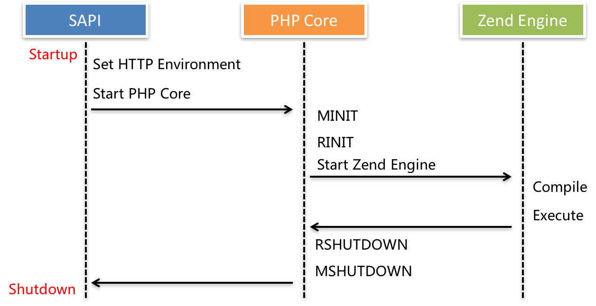

# 通过 Swoole 加速 Laravel

Swoole 是针对PHP的生产级异步编程框架。它是一种用纯C语言编写的PHP扩展，它使PHP开发人员能够在PHP中编写高性能，可扩展的并发TCP，UDP，Unix套接字，HTTP，WebSocket服务，而无需太多的非阻塞I/O编程和Linux内核知识。 你可以将Swoole想象成NodeJS，但是对于PHP来说，性能更高。

## 为什么要在Swoole上运行Laravel

下图说明了PHP中的生命周期。 正如你所看到的，当你每次运行php脚本时，PHP都需要初始化模块并为你的运行环境启动Zend Engine。 并且你的PHP脚本需要编译为OpCodes以供Zend Engine执行。

但是，这个生命周期需要在每个请求中重复一遍。因为为单个请求创建的环境将在请求过程完成后立即销毁。

换句话说，在传统的PHP生命周期中，它浪费了大量时间为脚本执行构建和销毁资源。 想象一下像 Laravel 这样的框架，需要为一个请求加载多少个文件？ 加载文件也有很多I/O消耗。



那么如果我们在Swoole之上有一个内置的服务器，并且所有的脚本可以在第一次加载后保存在内存中呢？ 这就是我们试图在Swoole上运行Laravel的原因。 Swoole可以成为强大的性能增强器，Laravel提供了优雅的结构和代码使用方式。 这是一个完美的组合！

## 安装

以下是 `swooletw/laravel-swoole` 的主要特点：

- 在Swoole上运行 Laravel/Lumen 应用程序
- 卓越的性能提升至 **30倍**
- 沙箱模式隔离应用程序容器
- 支持在Laravel中运行WebSocket服务器
- 支持Socket.io协议
- 支持Swoole表进行跨进程数据共享

使用Composer安装：

```bash
composer require swooletw/laravel-swoole -vvv
```

> 这个软件包依赖于Swoole。请确保你的机器具有Swoole扩展。你可以使用此命令快速安装它：`pecl install swoole`，并访问[官方网站](https://www.swoole.co.uk/docs/get-started/installation)获取更多信息。
> 注意：Swoole目前仅支持Linux和macOS。 Windows服务器不能使用Swoole。

然后，添加服务提供者：

如果你使用的是Laravel，请将服务提供者添加到 `config/app.php` 中提供者的数组中：

```php
[
    'providers' => [
        SwooleTW\Http\LaravelServiceProvider::class,
    ],
]
```

如果您使用的是 Lumen，请将以下代码附加到 `bootstrap/app.php`:

```php
$app->register(SwooleTW\Http\LumenServiceProvider::class);
```

> 它支持包自动发现。如果你运行的是Laravel 5.5，则可以跳过此步骤。

## 启动和运行

现在，你可以运行以下命令来启动Swoole HTTP服务器。

```bash
php artisan swoole:http start
```

然后你可以看到以下消息：

```bash
Starting swoole http server...
Swoole http server started: <http://127.0.0.1:1215>
```

现在你可以在 `http://127.0.0.1:1215` 上访问你的Laravel应用程序。

## 基准测试

使用MacBook Air 13,2015进行干净的Lumen 5.5测试。

基准测试工具：[wrk](https://github.com/wg/wrk)

```bash
wrk -t4 -c100 http://your.app
```

### Nginx with FPM

```bash
Running 10s test @ http://lumen.app:9999
  4 threads and 100 connections
  Thread Stats   Avg      Stdev     Max   +/- Stdev
    Latency     1.14s   191.03ms   1.40s    90.31%
    Req/Sec    22.65     10.65    50.00     65.31%
  815 requests in 10.07s, 223.65KB read
Requests/sec:     80.93
Transfer/sec:     22.21KB
```

### Swoole HTTP Server

```bash
Running 10s test @ http://127.0.0.1:1215
  4 threads and 100 connections
  Thread Stats   Avg      Stdev     Max   +/- Stdev
    Latency    11.58ms    4.74ms  68.73ms   81.63%
    Req/Sec     2.19k   357.43     2.90k    69.50%
  87879 requests in 10.08s, 15.67MB read
Requests/sec:   8717.00
Transfer/sec:      1.55MB
```

## 更多

查看 [Github Repo](https://github.com/swooletw/laravel-swoole) 和[官方文档](https://github.com/swooletw/laravel-swoole/wiki)获取更多信息。

> 原文地址：[https://laravel-news.com/laravel-swoole](https://laravel-news.com/laravel-swoole)